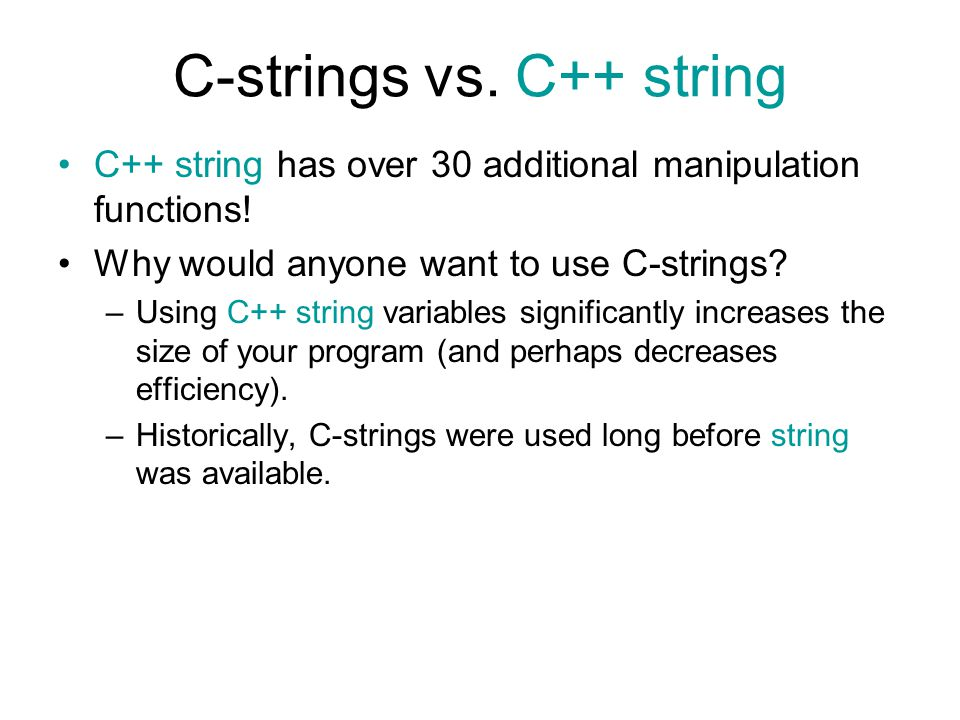

# Week 3 Agenda


## C-Strings vs C++ string
- char izard[1] = '\\0'
- const char * mander = "potato"
- string cheese = "hat"
- cheese[0] = 'c'
- cout


## argv, and arrrgc
```cpp
int main(int arrrgc, char ** argv){
	cout << arrrgc << endl;
	for(int i = 0; i < arrrgc; ++i){
		cout << argv[i] << endl;
	}
}
```
When run with input ./program.exe 1 potato 9:
```
4
./program.exe 1 potato 9
```

## IO
- ostream
	- cout
	- ofstream
	- stringstream
- istream
	- cin
	- ifstream
	- stringstream

## Makefile
Basics:
~~~make
target: dependencies
    command
~~~
Variables and comments:
~~~make
# This is a comment
FILES = file1.cpp file2.cpp
all:
    g++ $(FILES) -o a
~~~
Useful symbols:
- `$^` == dependencies
- `$@` == use target name here

~~~make
CXX = g++
FLAGS = -pedantic -Wall -Werror --std=c++11 -g

allllllll: cstring stream
	./stream 1 test0.txt

cstring: cstring.cpp
	${CXX} ${FLAGS} $^ -o $@

stream: streams.cpp
	${CXX} ${FLAGS} $^ -o $@

clean:
	rm -vf cstring stream
~~~

## Worksheet
[Worksheet](https://docs.google.com/document/d/1d_yzq3100-8WxdB_fVr0aBW8mIoIWfr9v0qRxfIACWY/edit)

## Lab Practice Questions
[Questions](https://docs.google.com/document/d/1hD3dplOCw1m9RTeDTFye7iB8wJEdV1wYeIZ3eEFa4h0/edit)


## Closing Time
