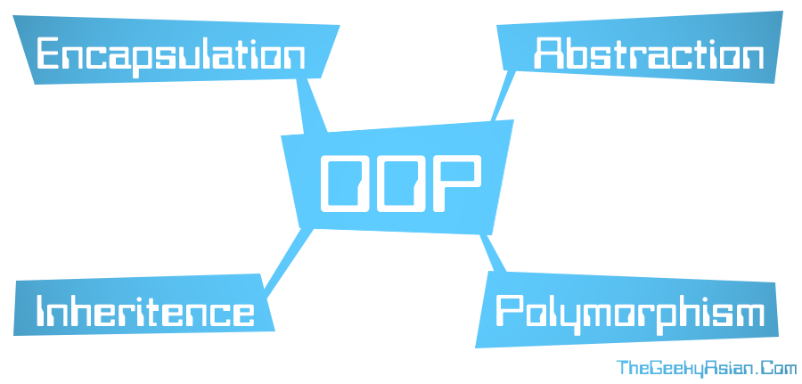

# Week 5 Agenda

*This is from last semester as I was not there*

## Inheritance
- why is this helpful?
- order of constructors
- virtual (pure virtual = 0)
- abstract
- override
- hiding

## Polymorphism
- many forms... literally useless
- why is this important?

## Overloading Operators
~~~cpp
int operator+(const Thing& thing1, const Thing& thing2)
~~~

## Staff Eval?

## Closing Time
